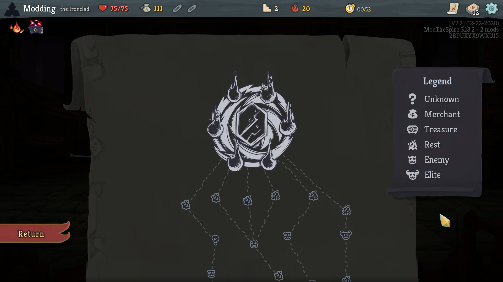

# Dark Map

Links: [Steam Workshop](https://steamcommunity.com/sharedfiles/filedetails/?id=2348942418), [Github](https://github.com/casey-c/darkmap)

A simple UI mod to give the map a night time theme. This mod was originally built to improve my late night modding experience, but I realized that it would be useful for regular game play as well! It started off as a small offshoot of a map overhaul mod I had been working on but ended up being useful enough to release on its own.

This mod also supports the [Colored Map mod](https://steamcommunity.com/sharedfiles/filedetails/?id=1611666859) to enable further customization of node colors.

